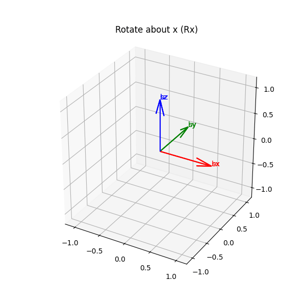

# modern-robotics-labbook

## What this is

This repo is my continuous learning labbook for basic robot control.
It follows structure of **[Modern Robotics (Lynch & Park)](https://modernrobotics.northwestern.edu/)**.  
For each lecture/chapter, the following are included:

- **Own interpretations** of the concepts (WHY-first)
- **Self-quizzes** (in my own words) to test understanding
- **Visualizations** to build geometric intuition  

Shared in case it would be helpful for other people as well.

---

## Visual chapter index

### Chapter 3 — Rigid-Body Motions

  

**Rotation matrices (SO(3))**
- Basis → full rotation
- Yaw / pitch / roll
- Composition: Rx → Ry → Rz
- Space vs body frames

[Open notebook →](notebooks/ch03_rotation_matrices_basis_to_3d.ipynb)

- Notes (WHY-first): [`notes/ch03_rigid_body_motions.md`](notes/ch03_rigid_body_motions.md)
- Notebook: SO(3) rotations: [`notebooks/ch03_so3_rotation.ipynb`](notebooks/ch03_so3_rotation.ipynb)
- Notebook: SE(3) twists: [`notebooks/ch03_twist_se3.ipynb`](notebooks/ch03_twist_se3.ipynb)
- Demo GIF: [`assets/ch03_twist_demo.gif`](assets/ch03_twist_demo.gif)
# 
